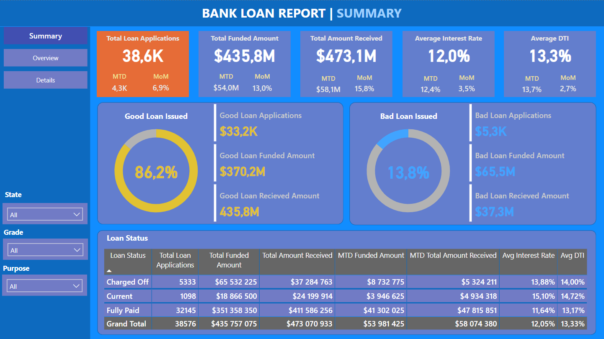
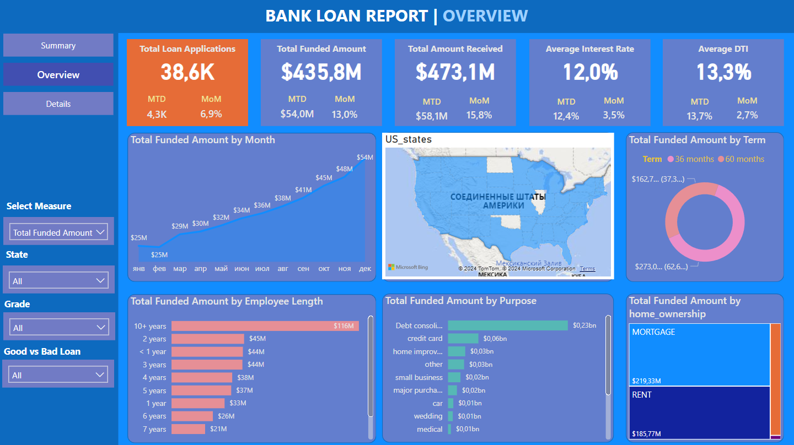
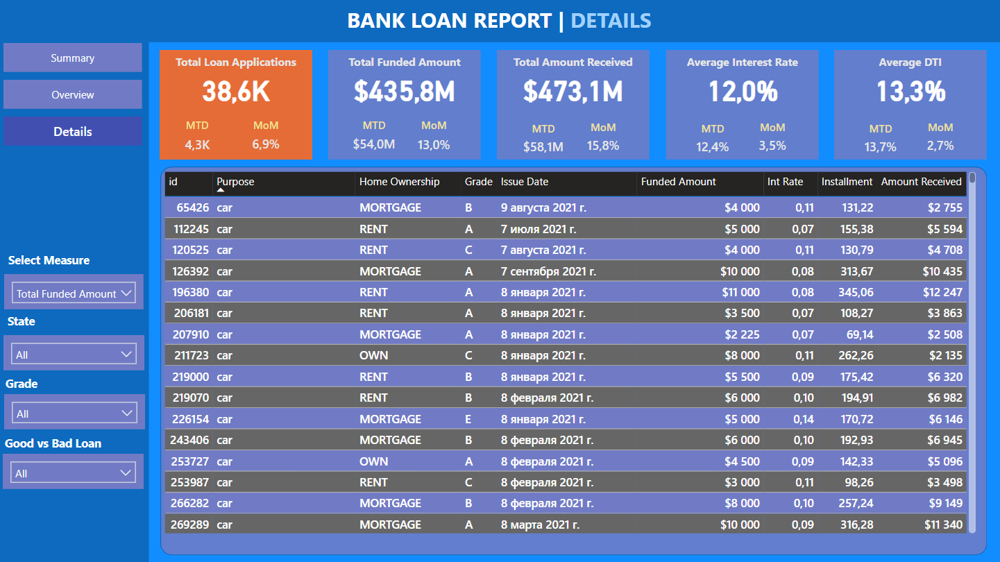

# Bank Loan Dashboard with Power BI
Bank loans are a crucial financial tool that enables individuals and businesses to achieve their goals and manage financial needs. However, it's essential for borrowers to understand the terms, costs, and responsibilities associated with loans to make informed financial decisions

Original file contains 38577 loan records with details on loan size, interest rate, term and some borrower's info.

## Summary page

**Summary** page categorize loans by status - is it good or bad.
This report aims to provide insights into key loan-related metrics and their changes over time. The report will help us make data-driven decisions, track our loan portfolio's health, and identify trends that can inform our lending strategies.

To evaluate the performance of our lending activities and assess the quality of our loan portfolio, we need to create a comprehensive report that distinguishes between 'Good Loans' and 'Bad Loans' based on specific loan status criteria.

To gain a comprehensive overview of our lending operations and monitor the performance of loans, we aim to create a grid view report categorized by Loan Status.

## Overview page

**Overview** page gives more tools to research on data in general. 
Here we aim to visually represent critical loan-related metrics and trends using a variety of chart types. These charts will provide a clear and insightful view of our lending operations, facilitating data-driven decision-making and enabling us to gain valuable insights into various loan parameters.

## Details page

**Details** page provides a consolidated view of all the essential information within our loan data. This Details Dashboard aims to offer a holistic snapshot of key loan-related metrics and data points, enabling users to access critical information efficiently.

